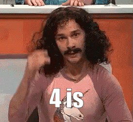

# Kata : 4 est magique

> **À propos**
>
> ⓘ Ceci est la donnée d'un [kata], un _exercice de programmation_ qui se
> déroule généralement dans le cadre d'un [coding dojo]. Il est proposé aux
> membres du dojo de l'[EPFL] et fait partie d'une collection de différents
> katas identifiés par le tag [epfl-dojo-kata] sur GitHub. Vous êtes plus que
> bienvenu d'essayer de le réaliser dans le langage de programmation de votre
> choix. Pour cela, un bon point de départ pour cela est de [forker] ce
> repository. Le «[stargazer]» en lui ajoutant une **☆** nous fait également
> très plaisir. Bonne lecture !

[kata]: https://fr.wikipedia.org/wiki/Coding_dojo#Kata
[coding dojo]: https://fr.wikipedia.org/wiki/Coding_dojo
[EPFL]: https://www.epfl.ch
[epfl-dojo-kata]: https://github.com/topics/epfl-dojo-kata
[forker]: https://docs.github.com/en/get-started/quickstart/fork-a-repo#forking-a-repository
[stargazer]: https://docs.github.com/en/get-started/exploring-projects-on-github/saving-repositories-with-stars

## But

Le but de ce kata est d'implémenter, dans le langage de programmation de votre
choix, un programme qui prend en entrée un entier et qui retourne une phrase en
français construite de la manière suivante : elle commence par la représentation
cardinale de l'entier, le verbe «est», puis la représentation cardinale du
nombre de caractères qui composent le premier mot, suivi d'une virgule. La
logique continue jusqu'à que le nombre 4 apparaisse, ce qui a pour résultat de
terminer la phrase avec «quatre est magique.».

## Exemples

* `1` Un est deux, deux est quatre, quatre est magique.
* `2` Deux est quatre, quatre est magique.
* `3` Trois est cinq, cinq est quatre, quatre est magique.
* `4` Quatre est magique.
* `10` Dix est trois, trois est cinq, cinq est quatre, quatre est magique.
* `18` Dix-huit est huit, huit est quatre, quatre est magique.
* `42` Quarante-deux est treize, treize est six, six est trois, trois est quatre,
  quatre est magique.
* `99` Nonante-neuf est douze, douze est cinq, cinq est quatre, quatre est magique.
* `1337` Mille trois cent trente-sept, vingt-huit est dix, dix est trois, trois
  est cinq, cinq est quatre, quatre est magique.
* `9999` Neuf mille neuf cent nonante-neuf est trente-trois, trente-trois est douze, cinq est quatre, quatre est magique.

## Consignes

- L'entier renseigné en entrée sera de 0 à 9999.
- Les espaces et les tirets des nombres en comportant sont comptés dans la longueur.
- Les utilisations de l'[Orthographe de 1990], du système [vigésimal], de l'helvétisme [huitante] ou d'autres variations préférées sont libres.

[Orthographe de 1990]: https://fr.wikipedia.org/wiki/Nombres_en_fran%C3%A7ais#Orthographe_de_1990
[vigésimal]: https://fr.wikipedia.org/wiki/Syst%C3%A8me_vic%C3%A9simal
[huitante]: https://fr.wikipedia.org/wiki/Nombres_en_fran%C3%A7ais#Suisse

## Pourquoi 4 est magique ?

Ce kata a été traduit de l'anglais, où «four» a bien 4 lettres. En anglais, le
chiffre 4 est le seul dont le nombre de lettre est équivalent à la cardinalité
du chiffre. Est-ce que 4 est magique pour autant ? [Wikipedia] nous apprend
que «Le chiffre 4 est le grand chiffre magique de toutes les civilisations
d'Amérique centrale : 4 âges pour la terre, 4 saisons [...]», mais est-ce
suffisant ? Probablement pas. Donc à moins que vous soyez [tétraphobe], un zeste
d'absurde n'a jamais fait de mal à personne et pour le bénéfice de l'exercice,
convenons que 4 est magique.

[Wikipedia]: https://fr.wikipedia.org/wiki/4_(nombre)#Chez_les_Premi%C3%A8res_Nations
[Tétraphobe]: https://fr.wikipedia.org/wiki/T%C3%A9traphobie

## Je l'ai fait 💪
* La version de [@octocat](https://github.com/octocat) a été faite en `langage` et est disponible [ici](https://#).
* La version de [@D4rkHeart](https://github.com/D4rkHeart) a été faite en `python` et est disponible [ici](https://github.com/D4rkHeart/kata-quatre).

## Pour aller plus loin

* Accepter les entiers négatifs, par exemple : `-1` Moins un est huit, huit est quatre, quatre est magique.
* Proposer des options pour les variantes (par exemple variante Française ou Suisse).
* Aller jusqu'au billion.
